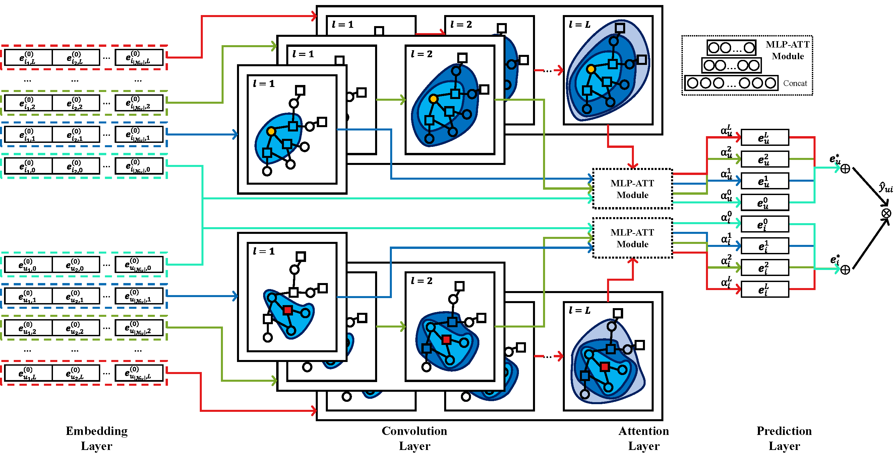
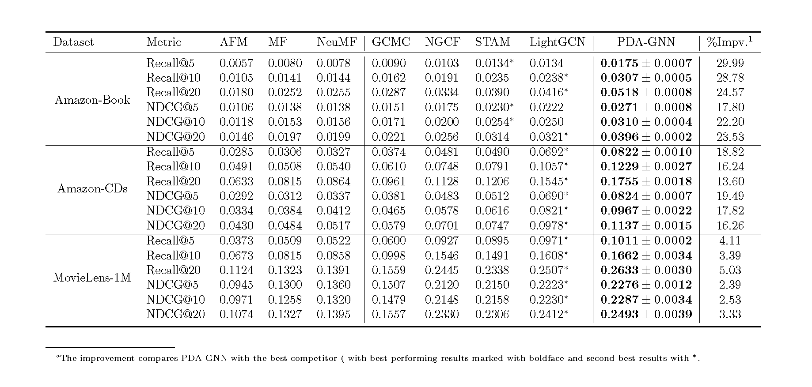

# PDA-GNN
This is the Official PyTorch Implementation for our paper:
>PDA-GNN: Propagation-Depth-Aware Graph Neural Networks for Recommendation.

## Overview
In this work, we propose PDA-GNN, a propagation-depth-aware GNN model for recommendation, which differentiates the attribute embeddings of the entities in recommender systems concerning propagation depth.

## Package
torch==1.11.0
numpy
pandas
sklearn

## Results

The overall performance is shown below:

